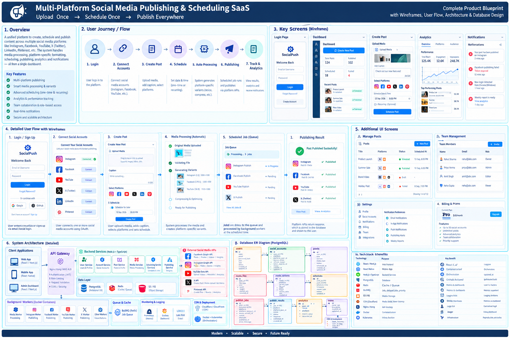
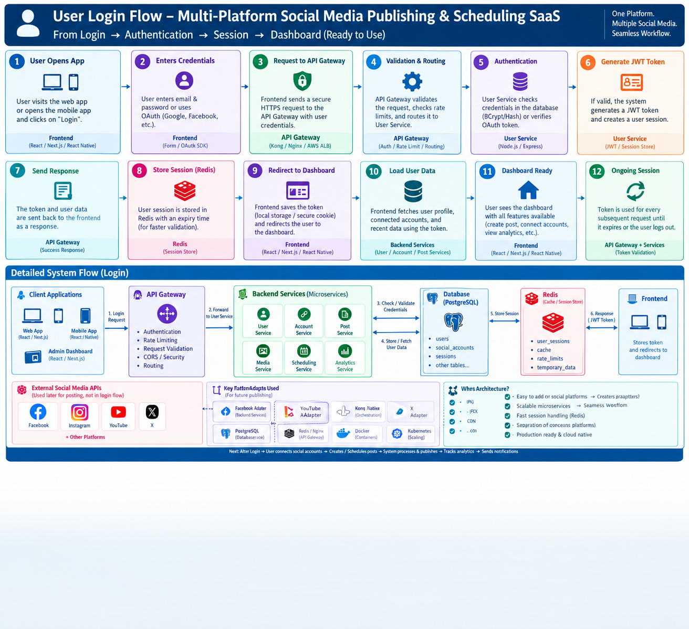
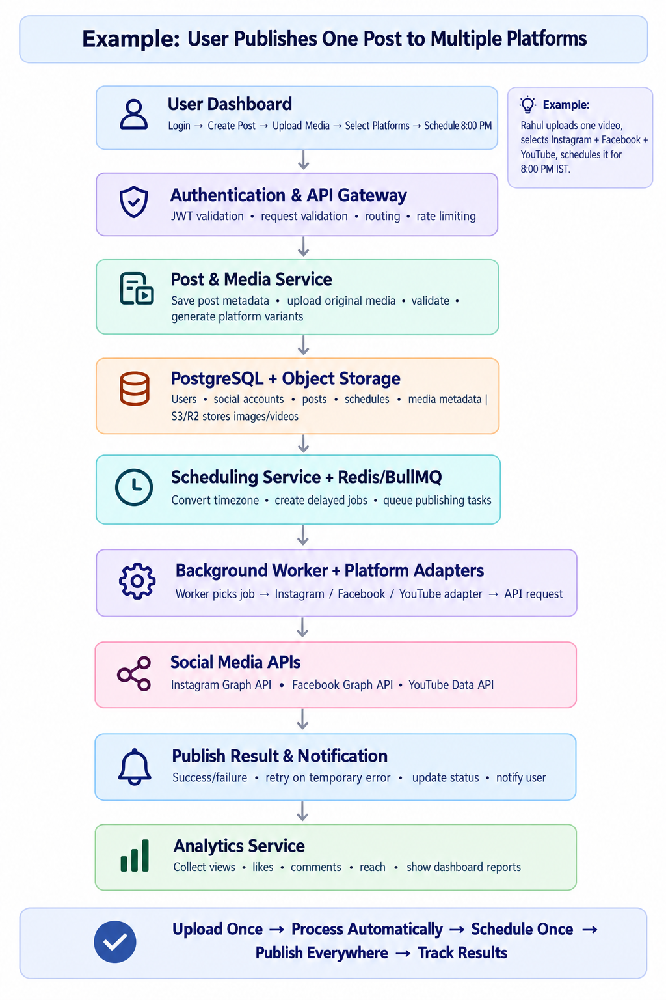
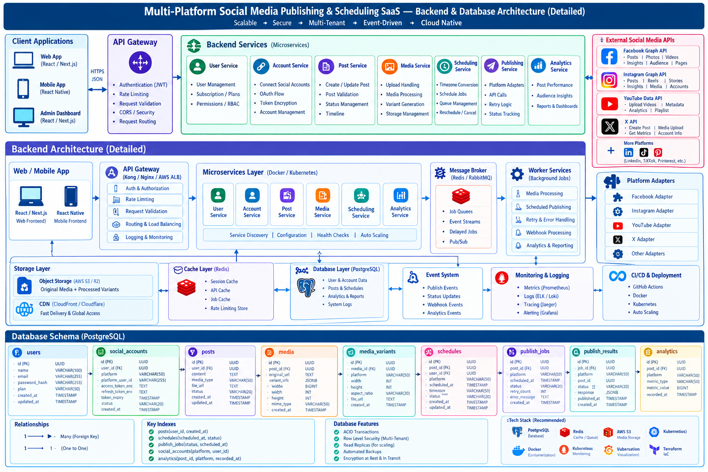
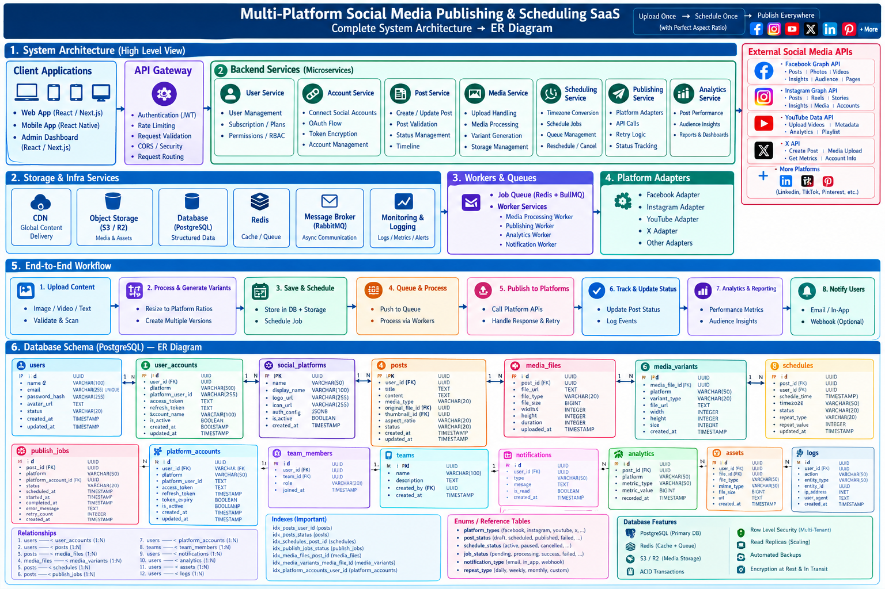
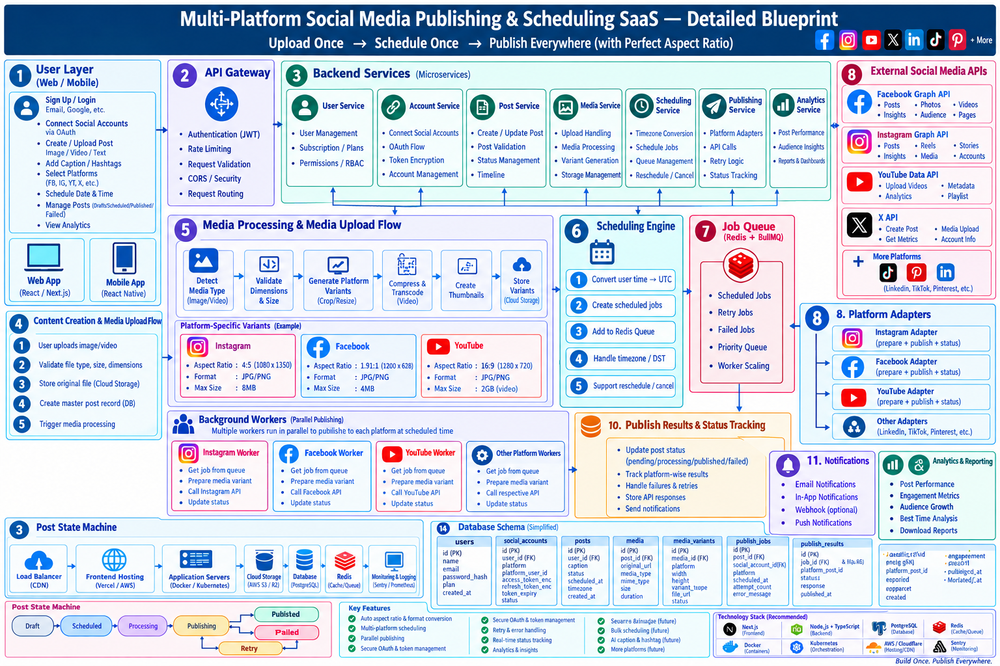

**Multi-Platform Social Media**

**Publishing & Scheduling SaaS**

Complete Project Blueprint

*Upload Once → Schedule Once → Publish Everywhere*

Prepared: September 12, 2026

Table of Contents

1\. Project Overview

2\. Product Blueprint --- Overview, User Journey & Wireframes

3\. User Login Flow

4\. End-to-End Publishing Workflow (Example)

5\. System Architecture --- Backend & Database (Detailed)

6\. Complete System Architecture & ER Diagram

7\. Detailed Technical Blueprint (Full System)

8\. Database Schema Summary

9\. Recommended Tech Stack

10\. Key Features & Supported Platforms

11\. Core Working Logic

12\. Next Steps

1\. Project Overview

This project, working name "SocialPush," is a unified SaaS platform that lets a user create content once and publish it across every major social media platform --- automatically resized, scheduled and tracked. The core promise of the product is captured in one line: Upload Once, Schedule Once, Publish Everywhere.

The platform is aimed at creators, marketing teams and agencies who currently have to upload the same content manually to Instagram, Facebook, YouTube, X and other platforms, resizing it by hand for each one. SocialPush removes that repetitive work by handling media processing, platform-specific formatting, scheduling, publishing and analytics from a single dashboard.

Core Value Proposition

-   Multi-platform publishing from a single upload

-   Smart media processing --- automatic aspect-ratio variants per platform

-   Advanced scheduling --- one-time and recurring posts

-   Analytics & performance tracking across all connected accounts

-   Team collaboration with role-based access control

-   Real-time notifications on publish success/failure

-   Secure, scalable, cloud-native architecture

2\. Product Blueprint --- Overview, User Journey & Wireframes

The diagram below is the master reference for the product: it summarises the concept, the 7-step user journey (Login → Connect Accounts → Create Post → Schedule → Auto Processing → Publishing → Track & Analytics), the key screen wireframes (Login, Dashboard, Create Post, Analytics, Notifications), the detailed step-by-step user flow with screens for connecting accounts and reviewing publish results, additional screens for managing posts and team members, the high-level system architecture, the database ER diagram, and the recommended technology stack.

*Figure 1 --- Complete Product Blueprint: Overview, User Journey, Wireframes, Architecture & DB Design*

Key takeaway: every screen in the product maps directly to one stage of the publishing pipeline, so the UI stays simple even though a lot of automated processing happens behind it (media variant generation, timezone conversion, queuing, multi-platform publishing, and result tracking).

3\. User Login Flow

Authentication follows a standard JWT session flow across 12 steps, from the user opening the app to landing on a fully-loaded dashboard:

-   User opens the web or mobile app and taps Login

-   User enters credentials (email/password) or uses OAuth --- Google/Facebook

-   Frontend sends a secure HTTPS request to the API Gateway

-   API Gateway validates the request, checks rate limits, and routes it to the User Service

-   User Service verifies credentials (bcrypt hash check) or validates the OAuth token

-   On success, the User Service generates a JWT and creates a session

-   The token and user data are returned to the frontend

-   The session is stored in Redis with an expiry time for fast validation

-   The frontend stores the token and redirects to the Dashboard

-   The frontend fetches the user's profile, connected accounts and recent activity

-   The dashboard renders fully --- create post, connected accounts, analytics all available

-   The JWT is reused for every subsequent request until it expires or the user logs out

*Figure 2 --- User Login Flow: Login → Authentication → Session → Dashboard*

4\. End-to-End Publishing Workflow (Example)

This walkthrough traces a single post through the entire system, using a sample scenario: a user uploads one video, selects Instagram + Facebook + YouTube, and schedules it for 8:00 PM.

*Figure 3 --- Example: User Publishes One Post to Multiple Platforms*

-   User Dashboard --- login, create post, upload media, select platforms, set schedule time

-   Authentication & API Gateway --- JWT validation, request validation, routing, rate limiting

-   Post & Media Service --- saves post metadata, uploads original media, validates it, generates platform variants

-   PostgreSQL + Object Storage --- structured data in Postgres, media files in S3/R2

-   Scheduling Service + Redis/BullMQ --- converts timezone, creates delayed jobs, queues publishing tasks

-   Background Worker + Platform Adapters --- a worker picks the job and calls the right adapter (Instagram/Facebook/YouTube) to hit the platform API

-   Social Media APIs --- Instagram Graph API, Facebook Graph API, YouTube Data API

-   Publish Result & Notification --- records success/failure, retries on temporary errors, notifies the user

-   Analytics Service --- collects views, likes, comments and reach for the dashboard

5\. System Architecture --- Backend & Database (Detailed)

The backend is a set of independent microservices sitting behind an API Gateway, communicating through a message broker for anything asynchronous (media processing, scheduled publishing, analytics collection).

*Figure 4 --- Backend & Database Architecture (Detailed)*

Backend Microservices

-   User Service --- authentication (JWT), rate limiting, subscription plans, permissions/RBAC

-   Account Service --- connecting social accounts, OAuth flow, token encryption, account management

-   Post Service --- create/update posts, validation, status management, timeline

-   Media Service --- upload handling, media processing, variant generation, storage management

-   Scheduling Service --- timezone conversion, schedule jobs, queue management, reschedule/cancel

-   Publishing Service --- platform adapters, API calls, retry logic, status tracking

-   Analytics Service --- post performance, audience insights, reports & dashboards

Infrastructure Layers

-   Cache Layer (Redis) --- session cache, API cache, job cache, rate-limit store

-   Database Layer (PostgreSQL) --- users, accounts, posts, schedules, analytics, logs

-   Event System --- publish events, status updates, webhook events, analytics events

-   Monitoring & Logging --- Prometheus metrics, ELK/Loki logs, Jaeger tracing, Grafana alerting

-   CI/CD & Deployment --- GitHub Actions, Docker, Kubernetes, auto-scaling

6\. Complete System Architecture & ER Diagram

This view lays out the full system end to end --- client apps, API Gateway, backend microservices, storage & infra, workers & queues, platform adapters, the 8-step workflow, and the complete PostgreSQL entity-relationship diagram.

*Figure 5 --- Complete System Architecture → ER Diagram*

End-to-End Workflow (8 steps)

-   Upload Content --- image / video / text, validate & scan

-   Process & Generate Variants --- resize to platform ratios, create multiple versions

-   Save & Schedule --- store in DB + storage, schedule the job

-   Queue & Process --- push to queue, process via workers

-   Publish to Platforms --- call platform APIs, handle response & retry

-   Track & Update Status --- update post status, log events

-   Analytics & Reporting --- performance metrics, audience insights

-   Notify Users --- email / in-app / webhook (optional)

Database Entities

Core tables: users, user_accounts, social_platforms, posts, media_files, media_variants, schedules, publish_jobs, platform_accounts, team_members, teams, notifications, analytics, assets, logs --- connected mostly through one-to-many relationships (e.g. one user has many social accounts; one post has many media variants). Row-level security enables multi-tenancy, and read replicas support scaling.

7\. Detailed Technical Blueprint (Full System)

This is the most granular view of the system, covering the media processing pipeline, the scheduling engine, the job queue, parallel background workers per platform, the post state machine, and notifications/analytics.

*Figure 6 --- Detailed Blueprint: Upload Once → Schedule Once → Publish Everywhere (with Perfect Aspect Ratio)*

Media Processing & Upload Flow

-   Detect media type (image/video)

-   Validate dimensions & size

-   Generate platform variants (crop/resize) --- e.g. Instagram 4:5, Facebook 1.91:1, YouTube 16:9

-   Compress & transcode video

-   Create thumbnails and store variants in cloud storage

Scheduling Engine

-   Convert user time → UTC

-   Create scheduled jobs and add to the Redis queue

-   Handle timezone / DST edge cases

-   Support reschedule / cancel

Post State Machine

-   Draft → Scheduled → Processing → Publishing → Published

-   Publishing → Failed → Retry (with backoff) → back into the queue

Background Workers

Multiple workers run in parallel, one style of worker per platform (Instagram Worker, Facebook Worker, YouTube Worker, etc.). Each picks a job off the queue, prepares the right media variant, calls the platform API through its adapter, and updates the post status.

8\. Database Schema Summary

A simplified view of the core PostgreSQL tables and what each one is responsible for:

  ------------------------------------- ------------------------------------------------------------------------------
  **Table**                             **Purpose**

  users                                 Core user accounts --- name, email, password hash, plan

  social_accounts / platform_accounts   OAuth-connected social accounts per user per platform, with encrypted tokens

  posts                                 Post content, caption, media type, status, scheduling metadata

  media_files                           Original uploaded media (file url, type, size, dimensions)

  media_variants                        Platform-specific resized/transcoded versions of a media file

  schedules                             When a post should publish, per platform, with timezone handling

  publish_jobs                          Queued publishing jobs --- status, retry count, error messages

  publish_results                       Outcome of each publish attempt --- response, published timestamp

  analytics                             Collected metrics per post per platform --- views, likes, reach, etc.

  notifications                         In-app / email / webhook notifications to users

  teams / team_members                  Team accounts and role-based membership (Owner/Admin/Editor/Viewer)

  logs                                  System and audit logs for monitoring and debugging
  ------------------------------------- ------------------------------------------------------------------------------

9\. Recommended Tech Stack

Build decision: Supabase is used as a managed backend-as-a-service for authentication, the primary database, and object storage. This removes the need to build and host a custom User Service, a standalone Postgres instance, and separate object storage --- without changing anything about the publishing/scheduling engine itself, which remains fully custom (see Section 11, Core Working Logic).

  -------------------- -------------------------------------------------------------- -------------------------------------------------------------------------------
  **Layer**            **Technology**                                                 **Purpose**

  Web frontend         React / Next.js                                                Dashboard, marketing site

  Mobile app           React Native                                                   iOS & Android app

  App authentication   Supabase Auth                                                  User signup/login/session for the SocialPush app itself

  Database             Supabase (managed PostgreSQL)                                  Primary relational data store, with Row Level Security

  Object storage       Supabase Storage                                               Original media + processed variants, S3-compatible

  Backend services     Node.js + TypeScript                                           Custom microservices: Account, Post, Media, Scheduling, Publishing, Analytics

  API Gateway          Nginx (simple) → Kong later                                    Routing/rate limiting in front of the custom Node services only

  Cache / Queue        Redis + BullMQ                                                 Session cache, job queue, rate limiting --- not covered by Supabase

  CDN                  Supabase Storage CDN / Cloudflare                              Fast global media delivery

  Containers           Docker                                                         Service packaging

  Orchestration        Docker Compose → Kubernetes (scale phase)                      Scaling & deployment of the custom services

  CI/CD                GitHub Actions                                                 Automated build & deploy

  Monitoring           Sentry (+ Supabase dashboard) → Prometheus/Grafana/ELK later   Error tracking, metrics, logs, alerting
  -------------------- -------------------------------------------------------------- -------------------------------------------------------------------------------

Important distinction: Supabase Auth handles login for people using SocialPush. It is unrelated to the OAuth connections to Instagram, Facebook, YouTube and X that let the platform publish on a user\'s behalf --- those remain a fully custom flow inside the Account Service, with tokens encrypted at the application level before being stored.

10\. Key Features & Supported Platforms

Supported Platforms

-   Facebook --- posts, photos, videos, insights, audience, pages

-   Instagram --- posts, reels, stories, insights, media, accounts

-   YouTube --- upload videos, metadata, analytics, playlists

-   X (Twitter) --- create post, media upload, metrics, account info

-   LinkedIn, TikTok, Pinterest --- planned for a later phase

Core Features

-   Multi-platform publishing from one upload

-   Automatic aspect-ratio variant generation per platform

-   One-time and recurring scheduling with timezone handling

-   Retry & error handling for failed publishes

-   Real-time status tracking (Draft / Scheduled / Published / Failed)

-   Analytics dashboard --- performance, engagement, top posts

-   Team accounts with roles: Owner, Admin, Editor, Viewer

-   Notifications --- email, in-app, optional webhooks

-   Billing & subscription plans

11\. Core Working Logic

The architecture above describes the components. This section describes the underlying logic that ties them together --- the principles the system actually runs on at execution time.

1\. Single Source, Multiple Derivatives

The user uploads one original file, which is stored permanently and never modified. For every target platform, a separate derived copy (variant) is generated from that original based on a platform-ratio config --- one source produces N outputs, and reprocessing is always possible because the original is untouched.

2\. Fan-Out Logic --- Post ≠ Job

When a post targets multiple platforms, the system does not create one job --- it creates one independent job per platform. This is the central design decision: if the Instagram job fails, the Facebook and YouTube jobs are unaffected and continue on their own lifecycle.

3\. Decoupled Time Logic

The schedule time the user picks (in their local timezone) is converted to UTC and turned into a delayed job in the queue. The Scheduling Service only decides "when" --- it has no knowledge of "who publishes it," keeping timing logic fully separate from execution logic.

4\. Pull-Based Queue & Worker Logic

Jobs sit in the queue until their scheduled time arrives. Each platform has its own worker (Instagram Worker, Facebook Worker, etc.) that continuously polls the queue and pulls a job once it is due. Multiple workers run in parallel, so many posts scheduled for the same moment are processed simultaneously rather than one at a time.

5\. Adapter Pattern --- Platform-Agnostic Core

The core publishing logic (queue handling, retries, status updates) has no platform-specific code in it. Each platform exposes the same three operations through its adapter --- prepareMedia(), publish(), getStatus() --- so adding a new platform means writing one new adapter, not modifying the core system.

6\. State Machine Logic

Every job moves through a fixed path: Draft → Scheduled → Processing → Publishing → Published. On failure: Publishing → Failed → Retry (with backoff) → back into the queue. Strict transitions prevent a post from being published twice or getting stuck in an undefined state.

7\. Smart Retry Logic

Failures are classified in two ways. Temporary failures (network timeout, rate limit) trigger an automatic retry with exponential backoff. Permanent failures (expired token, invalid content) are not retried --- the user is notified directly so they can fix the underlying issue.

8\. Aggregate Status Logic

A post's overall status is derived from the status of all of its per-platform jobs. If 2 of 3 platforms succeeded and 1 failed, the dashboard shows "Partially Published" rather than a single pass/fail flag.

9\. Event-Driven Notifications

When a publish attempt completes, it fires a success or failure event. The Notification Service listens for that event and sends the email/in-app alert --- the publishing logic itself has no knowledge that notifications exist, keeping the two fully decoupled.

10\. Analytics Pull Logic

After a post is published, a separate periodic job queries each platform's API for metrics (views, likes, reach) using the stored access token, and writes the result into the analytics table as time-series data for the dashboard to display.

Summary

Upload → one source produces N platform variants → N independent per-platform jobs → UTC-based scheduled trigger → parallel workers publish via adapters → each job tracks its own status → aggregate status + event-driven notifications + periodic analytics pull. Every layer is decoupled from the next, so a failure or slowdown in one part never blocks the rest of the system.

12\. Next Steps

This blueprint captures the target-state architecture for SocialPush. It is intentionally broader than a first release --- it includes enterprise features like Kubernetes auto-scaling, full RBAC and team billing that a v1 does not need.

The companion Development Blueprint document breaks this down into build phases, starting with a minimal single-platform MVP and working up to this full architecture, along with the engineering rules and conventions to follow while building it.
